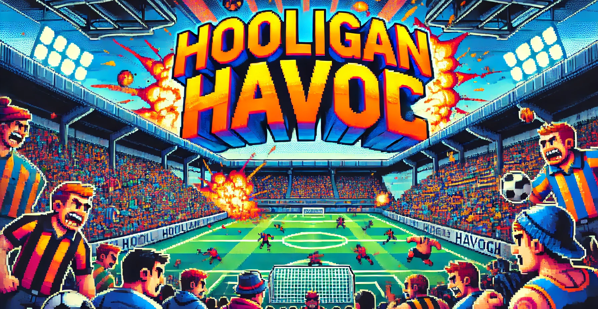

# Hooligan Havoc ⚽🔥

**Hooligan Havoc** is a fast-paced action game with **Top-Down Auto-Shooter** and **Rogue-like** mechanics, developed in **Unity** with **C#**. Players take on the role of a football ultra in a chaotic stadium, battling waves of rival hooligans with automatic weapons and upgrades.

## 📜 Table of Contents
- [📌 Project Overview](#-project-overview)
- [🛠️ Installation](#️-installation)
- [🎮 How to Play](#-how-to-play)
- [📂 Project Structure](#-project-structure)
- [🖥️ Technologies Used](#-technologies-used)
- [🙌 Credits](#-credits)

## 📌 Project Overview

In **Hooligan Havoc**, players fight off waves of rival hooligans in an intense battle for dominance inside a stadium. The game mechanics include:

- **Auto-shooting combat**: The player character automatically shoots enemies while the player focuses on movement and positioning.
- **Wave-based survival**: Each round increases in difficulty with stronger and more numerous enemies.
- **Power-ups and upgrades**: Every few rounds, upgrades are given to the player in order to survive upcoming enemies.

## 🛠️ Installation

1. Clone the repository:
   ```sh
   git clone https://github.com/yourusername/HooliganHavoc.git
   ```
2. Open the project in **Unity** (recommended version: `Unity 2022.X` or later).
3. Load the `MainScene` and press **Play** to start the game.
4. (Optional) Build the game via `File > Build Settings` for your preferred platform.

## 🎮 How to Play

### 🎯 Objective
Survive waves of rival hooligans and dominate the stadium!

### 🕹️ Controls
- **WASD / Arrow Keys** - Move your character
- **Escape** - Pause the game

### 📈 Progression
- Each wave introduces stronger enemies.
- Survive long enough to unlock new weapons and abilities.
- Game ends if the player is defeated or the final boss is beaten.

## 📂 Project Structure

The **Hooligan Havoc** project is organized as follows:

```plaintext
Hooligan Havoc/               # Main project folder
│── Hooligan Havoc/           # Contains all Unity project files
│   ├── Assets/               # Project assets
│   │   ├── Animations/       # Game animations
│   │   ├── Prefabs/          # Prefabricated objects for reuse
│   │   ├── Scenes/           # Game scenes
│   │   ├── Scripts/          # C# game scripts
│   │   ├── Settings/         # Game settings and configurations
│   │   │   └── Scenes/       # Scene-specific configurations
│   │   ├── Sprites/          # Game sprites and graphics
│   │   └── TextMesh Pro/     # TextMesh Pro resources for text rendering
│   │       ├── Fonts/        # Custom fonts
│   │       ├── Resources/    # TextMesh Pro materials and resources
│   │       │   ├── Fonts & Materials/ # Font materials
│   │       │   ├── Sprite Assets/     # Sprites used in text rendering
│   │       │   └── Style Sheets/      # TextMesh Pro style sheets
│   │       ├── Shaders/       # Shaders and graphical effects
│   │       └── Sprites/       # Additional TextMesh Pro sprites
│   ├── Library/               # Unity-generated files (Do not modify)
│   ├── Logs/                  # Log files for debugging
│   ├── Obj/                   # Compiled objects
│   ├── Packages/              # Project dependencies and packages
│   ├── ProjectSettings/       # Unity project settings
│   ├── UserSettings/          # User-specific Unity settings
│   └── .gitignore             # Git ignore file to exclude unnecessary files
│── README.md                  # Project documentation for GitHub
```

## 🖥️ Technologies Used

### 🔧 Development
- **Unity Engine** (2022.X)
- **C#** for scripting
- **TextMeshPro** for UI elements
- **Cinemachine** for smooth camera movements

### 🎨 Art & Audio
- **Aseprite** (for pixel art)
- **FMOD** (for sound design)
- **OpenGameArt** (for free assets)

### 🧠 AI & Game Mechanics
- **Unity NavMesh** (for enemy AI navigation)
- **Scriptable Objects** (for power-up and upgrade management)

## 🙌 Credits

### 🎮 Development Team
- **[Your Name]** - Lead Developer
- **[Teammate Name]** - Game Designer
- **[Teammate Name]** - Artist & Animator

### 🛠️ Special Thanks
- **Unity Community** for tutorials and documentation
- **Open-source asset creators** for free sound and visual assets
- **Friends & Playtesters** for feedback and support

---

⚽ **Join the Chaos and Dominate the Stadium in Hooligan Havoc!** 🔥
